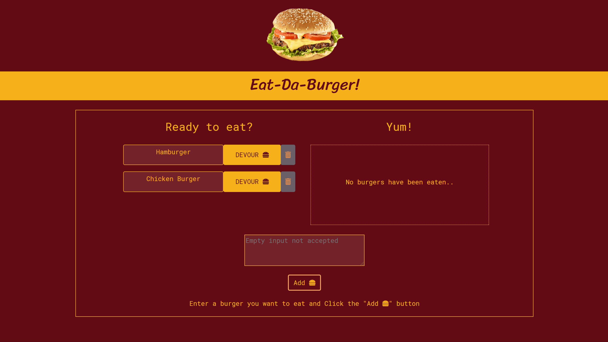

# Burger
Add your favorite burger :hamburger: and devour it! :yum: 
Burgers that have been eaten go to the right side with an option to eat again.  
Burgers that are available to eat stay on the left side with options to devour it or delete it.

# Screenshots

# Tech/framework used
* Programming Languages: JavaScript/jQuery, HTML, CSS, Bootstrap
* Browser Based Technologies: Responsive Design
* Databases: MySQL
* Deployment: Heroku, Git
* Server-Side Deployment: Express.js, Node.js
* Library/Package: Mysql, Express, Express-handlebars, Body-parser
* Other tools: Visual Studio Code

# Setup
To run this project:
* Option 1: [Live Link](https://warm-savannah-43585.herokuapp.com/) :pushpin:
* Option 2: Local Server
    1. Clone to your computer :computer:
    <pre> git clone https://github.com/schoe14/Burger.git </pre>
    2. Install packages :star2:
    <pre> npm install </pre>
    3. Go to `Burger/config/connection.js` and enter your own password to connect MySQL :unlock:
    4. Make sure data in schema.sql and seeds.sql goes through MySQL :calling:
    5. Command :+1:
    <pre> node server </pre>
